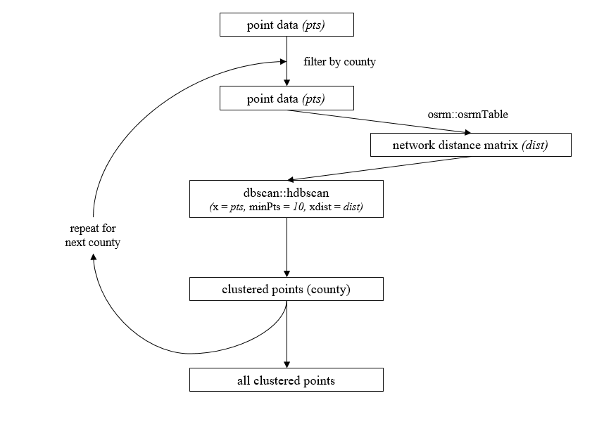
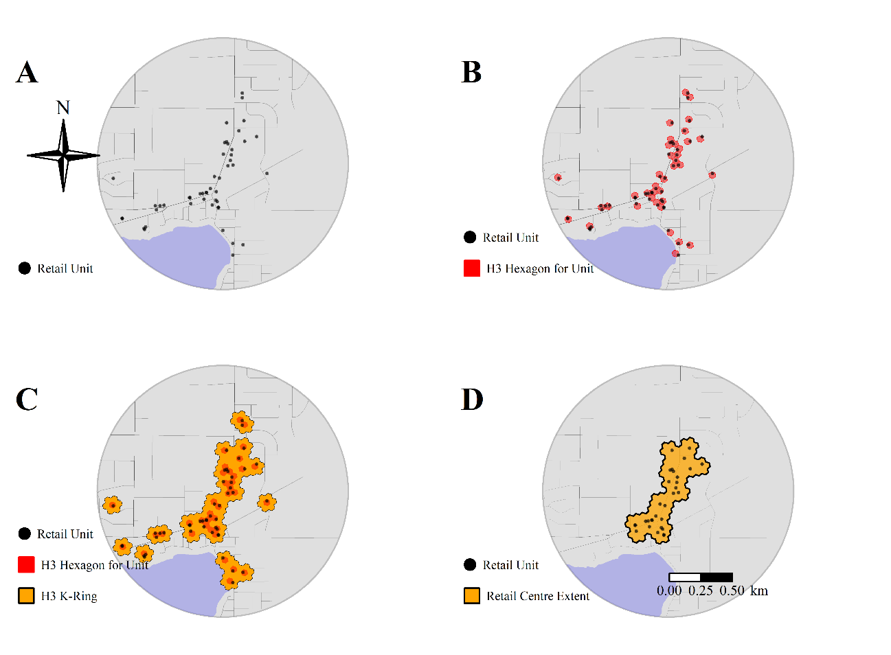

# Chicago-Retail-Centres

### A Framework for Delineating the Scale, Extent and Characteristics of American Retail Centre Agglomerations: The Case Study of Chicago Metropolitan Area during COVID-19.
Patrick Ballantyne, Alex Singleton, Les Dolega, Kevin Credit.

---

*Abstract*

Concentrations of retail units and their associated activities, formally defined as 
‘retail centres’, are important tools for understanding the distribution and evolution of the retail sector at varying geographical scales. This paper presents a framework through which formal definitions and typologies of retail centres, such as those in the UK, can be extended to the US. Using the Chicago Metropolitan Statistical Area as a case study and data from SafeGraph, we present a retail centre delineation method that combines Hierarchical-DBSCAN with ‘H3’, and demonstrate the usefulness of a non-hierarchical approach to retail classification. In addition, we show that the dynamicity and comprehensibility of retail centres makes them an effective tool through which to better understand the impacts of COVID-19 on retail sector dynamics, through exploration of changes to retail centre visits during the pandemic. This approach demonstrates significant scope for a comprehensive classification of retail centre agglomerations for the US, providing a tool through which to monitor the evolution of American retail. 

---

*ChicagoRetailCentres*

This repo contains all the code used to extract and classify retail centres for the Chicago Metropolitan Area. For clarity, we have divided the code into two sections:

1. Delineating Urban Retail Centres
2. A Typology of Retail Centres

---

*Part One - Delineating Urban Retail Centres*

Retail Centres were delineated by combining two approaches:

* Unsupervised machine learning (HDBSCAN), with network distance matrices [image on left]
* Using H3 geometries and Graph objects to identify contiguous tracts of retail locations [image on right]

A barebones example has been provided in the file titled 'retail_centre_delineation.md', where you can see an example of how to extract retail centres using this approach.

---

  
   

---

*Part Two - A Typology of Retail Centres*

The typology was extracted using the PAM (partitioning around medoids) algorithm, which uses median values over means, giving it a significant advantage over k means. 20 variables were used, and clustergrams in conjunction with average silhouette scores were used to determine the optimal *k* value.

A barebones example has been provided in 'retail_centre_typology.md', where you can see an example of how you could extract a typology similar to mine using this approach.
